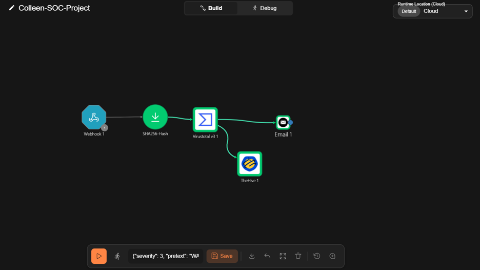
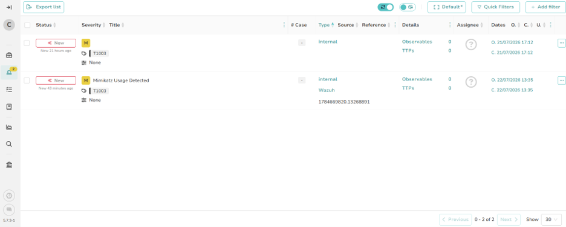
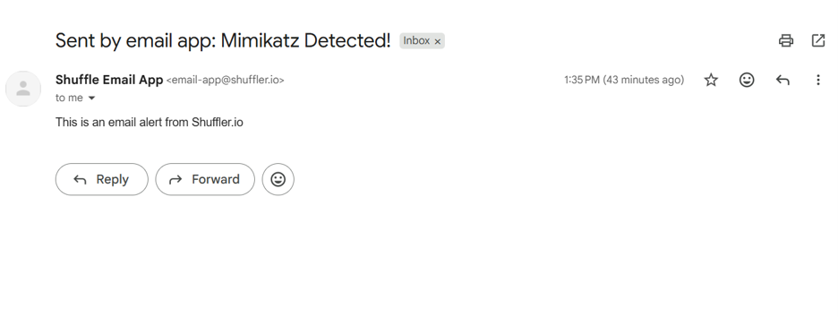

# soc-automation-lab
Automated SOC Incident Response & Threat Intelligence Pipeline using Wazuh, Shuffle SOAR, VirtusTotal API, and TheHive 5.

# Automated SOC Incident Response & Threat Intelligence Pipeline

## Overview
This project demonstrates an end-to-end automated Security Operations Center (SOC) workflow. It captures endpoint security events generated on a Windows 11 host, processes them through a SIEM, enriches threat telemetry using SOAR playbooks, and automates alert management and analyst notifications.

---

## Architecture & Data Flow
1. **Detection:** Windows 11 host detects credential dumping activity (`Mimikatz` / MITRE ATT&CK T1003).
2. **SIEM Processing:** Wazuh Manager parses the alert log and triggers a webhook via rule `100002`.
3. **SOAR Automation:** Shuffle SOAR receives the JSON webhook payload.
4. **Data Extraction:** Dynamic Regex parsing extracts the file's SHA-256 hash string.
5. **Threat Enrichment:** Shuffle queries the VirusTotal v3 API for file reputation analysis.
6. **Incident Ticketing:** Enriched alert details automatically populate inside TheHive 5 for analyst triage.
7. **Analyst Alerting:** An automated email notification is dispatched to the SOC team.

---

## Workflow & Evidence

### 1. Shuffle SOAR Workflow Construction
*Automated playbook connecting the Wazuh Webhook, SHA-256 Regex Parser, VirusTotal Enrichment, TheHive Incident Creation, and Email Alerting.*

---

### 2. Incident Generation in TheHive 5
*Successful creation of the "Mimikatz Usage Detected" alert in TheHive 5, complete with dynamic reference IDs and severity mappings.*

---

### 3. Automated Analyst Email Notification
*Real-time email alert dispatched via Shuffle upon threat verification.*

---

## 🛠️ Technologies Used
* **SIEM:** Wazuh
* **SOAR:** Shuffle SOAR
* **Threat Intelligence:** VirusTotal v3 API
* **Incident Management:** TheHive 5
* **OS / Virtualization:** Ubuntu Server 22.04 LTS, Windows 11 Enterprise, VirtualBox
* **Protocols & Concepts:** REST APIs, Webhooks, JSON Parsing, Regex, MITRE ATT&CK Framework
